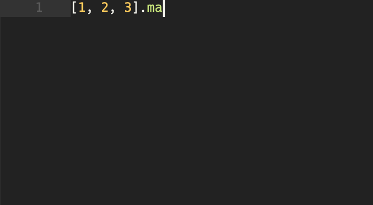
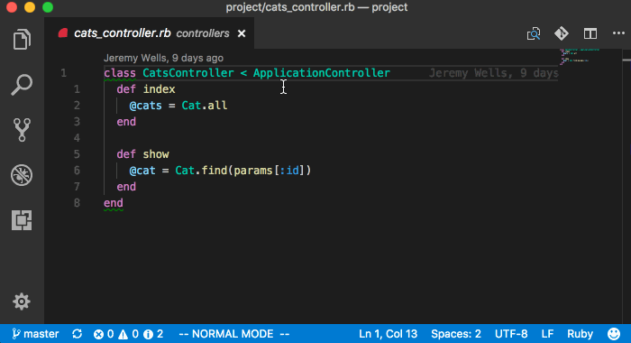
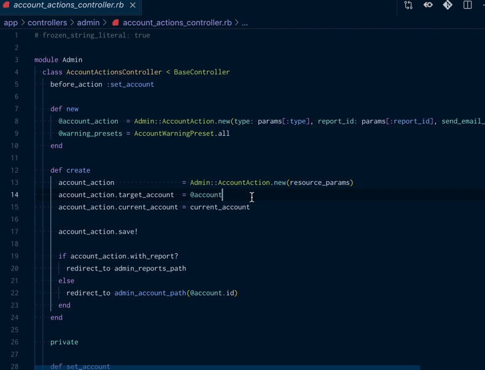
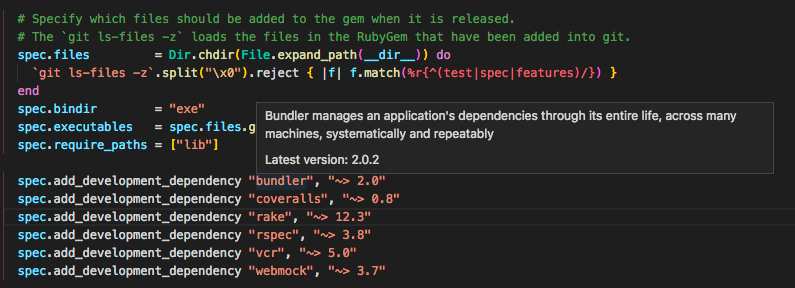
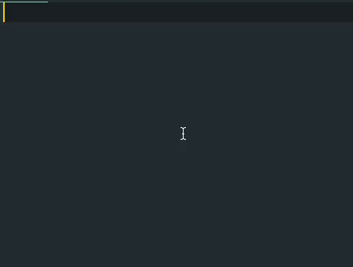
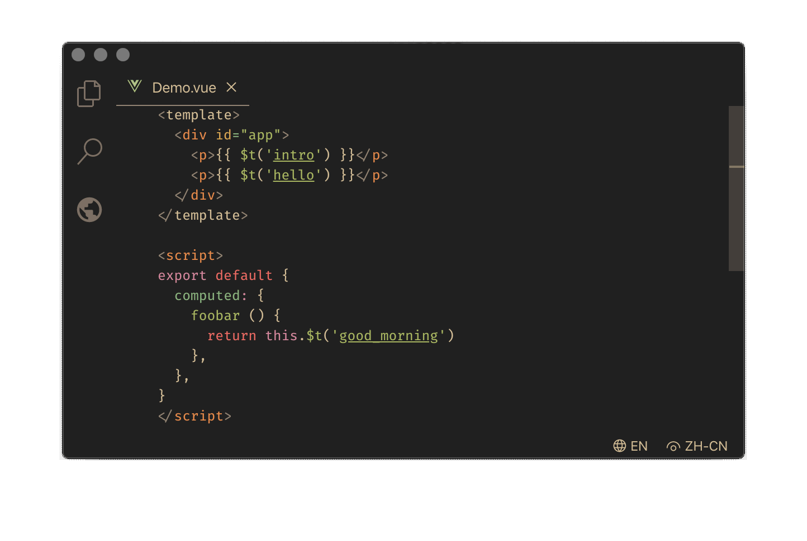

# Ruby and Rails Extension Pack

23 carefully selected extensions and little helper that I use to develop Ruby and Ruby on Rails applications.

## Highlights

#### [Endwise](https://marketplace.visualstudio.com/items?itemName=kaiwood.endwise) — wisely adds the "end" keyword to code structures

#### [Rails Fast Nav](https://marketplace.visualstudio.com/items?itemName=jemmyw.rails-fast-nav) — alt/option + r helps you to find related rails parts (views, controllers, models, specs, ...)

#### [Quick Open Rails](https://marketplace.visualstudio.com/items?itemName=aki77.quick-open-rails) — helps you to search for you rails stuff. You need to configure a shortcut!

#### [Gem Lens](https://marketplace.visualstudio.com/items?itemName=ninoseki.vscode-gem-lens) — See additional informations for the gems in your Gemfile.

#### [Auto Add Brackets](https://marketplace.visualstudio.com/items?itemName=aliariff.auto-add-brackets) — Interpolate Strings with ease!

#### [I18N Ally](https://marketplace.visualstudio.com/items?itemName=lokalise.i18n-ally) — Super Charges your work with translations.
**Hint**: To use the i18n Ally extension you may need to enable rails in your settings.json with `"i18n-ally.enabledFrameworks": ["ruby-rails"]`

## Complete Overview

### Common Stuff
- [auto-add-brackets](https://marketplace.visualstudio.com/items?itemName=aliariff.auto-add-brackets)
- [endwise](https://marketplace.visualstudio.com/items?itemName=kaiwood.endwise)
- [dotenv](https://marketplace.visualstudio.com/items?itemName=mikestead.dotenv)
- [i18n-ally](https://marketplace.visualstudio.com/items?itemName=lokalise.i18n-ally)
- [docs-yaml](https://marketplace.visualstudio.com/items?itemName=docsmsft.docs-yaml)
- [vscode-yaml-sort](https://marketplace.visualstudio.com/items?itemName=pascalreitermann93.vscode-yaml-sort)

### Ruby
- [ruby](https://marketplace.visualstudio.com/items?itemName=rebornix.ruby)
- [ruby-symbols](https://marketplace.visualstudio.com/items?itemName=miguel-savignano.ruby-symbols)
- [vscode-gem-lens](https://marketplace.visualstudio.com/items?itemName=ninoseki.vscode-gem-lens)
- [ruby-around-the-block](https://marketplace.visualstudio.com/items?itemName=elliotlarson.ruby-around-the-block)

### Rails
- [ruby-and-rails-snippets](https://marketplace.visualstudio.com/items?itemName=cjay.ruby-and-rails-snippets)
- [rails-fast-nav](https://marketplace.visualstudio.com/items?itemName=jemmyw.rails-fast-nav)
- [quick-open-rails](https://marketplace.visualstudio.com/items?itemName=aki77.quick-open-rails)
- [rails-db-schema](https://marketplace.visualstudio.com/items?itemName=aki77.rails-db-schema)
- [rails-partial](https://marketplace.visualstudio.com/items?itemName=aki77.rails-partial)
- [rails-routes](https://marketplace.visualstudio.com/items?itemName=aki77.rails-routes)
- [rails-view-component](https://marketplace.visualstudio.com/items?itemName=aki77.rails-view-component)
- [erb](https://marketplace.visualstudio.com/items?itemName=craigmaslowski.erb)
- [erb-vscode-snippets](https://marketplace.visualstudio.com/items?itemName=ZneuRay.erb-vscode-snippets)
- [rails-go-to-spec](https://marketplace.visualstudio.com/items?itemName=sporto.rails-go-to-spec)

### Haml
- [haml](https://marketplace.visualstudio.com/items?itemName=karunamurti.haml)
- [haml-lint](https://marketplace.visualstudio.com/items?itemName=aki77.haml-lint)

### Rspec
- [rails-run-spec-vscode](https://marketplace.visualstudio.com/items?itemName=noku.rails-run-spec-vscode)
- [rspec-snippets-vscode](https://marketplace.visualstudio.com/items?itemName=ldrner.rspec-snippets-vscode)

## Credits
Special thanks to all extension authors who help me to be more productive!

- [Ruby Hero](https://icons8.com/icon/64516/ruby-programming-language) icon by [Icons8](https://icons8.com)
- [Ruby Icon](https://icons8.com/icon/3bzw1uhK78yO/ruby-programming-language) icon by [Icons8](https://icons8.com)
